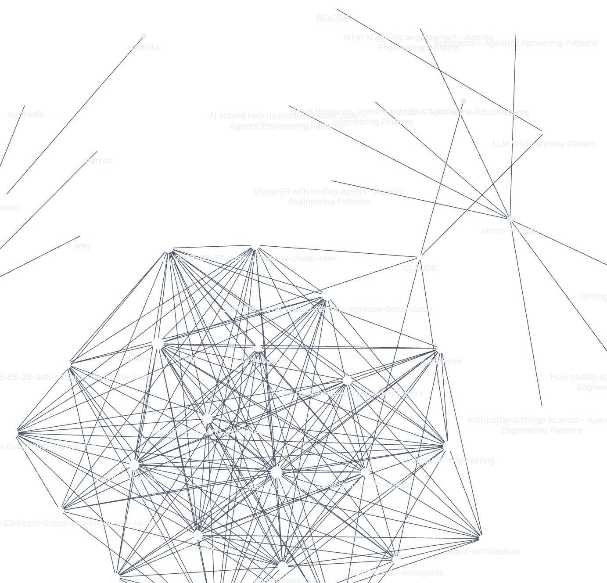

# Agentic Engineering Wiki

### Note
_This particular implementation was inspired by [Karpathy's LLM Wiki Pattern](https://gist.github.com/karpathy/442a6bf555914893e9891c11519de94f)._

_For more references: [Karpathy's X post](https://x.com/karpathy/status/2039805659525644595?s=20)_

### Software

_Interfaz_
- [Obsidian](https://obsidian.md/download)

_LLM Agent_
- [ Claude Code](https://code.claude.com/docs/en/quickstart)

_Control Version_
- Github

---

The wiki is the Juan's personal **Agentic Engineering knowledge-base** oriented: it accumulates a structured and curated information about Agentic Engineering discipline — built up from articles, papers, books, videos, transcripts, and notes over time. See [[LLM Wiki Karpathy Pattern]] for the philosophy behind the pattern.

The goal is to keep an updated information source with the last advances, techniques, methodologies and implementations.

